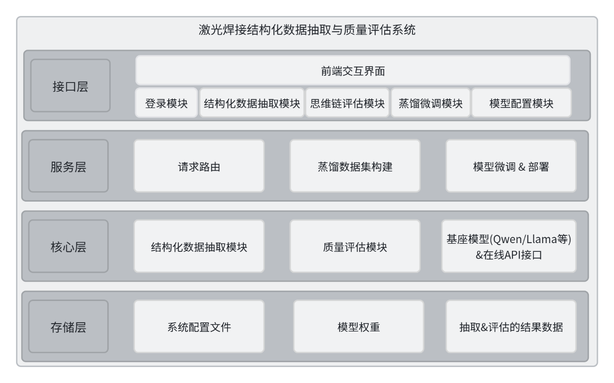

# 激光焊接结构化数据抽取与质量评估系统操作手册

---

## 1 系统概要

### 1.1 系统简介

激光焊接结构化数据抽取与质量评估系统是面向激光焊接科研、工艺分析与模型训练场景开发的软件系统。系统针对激光焊接领域文献、试验报告、工艺记录等非结构化文本资料，提供结构化信息抽取、抽取结果质量评估、蒸馏样本构建、模型微调与模型配置管理等功能。

系统以激光焊接领域中的材料信息、工艺参数、缺陷类型、检测结果、质量指标等关键知识要素为处理对象，通过大语言模型与规则化数据结构相结合的方式，将原始文本内容转化为规范化的实体、关系及评价结果，便于后续进行数据分析、知识库建设和领域模型迭代。

系统采用 B/S 架构设计，通过统一的 Web 前端界面对外提供服务。前端负责用户登录、任务配置、抽取结果展示、评估过程可视化及模型管理等交互功能；后端负责请求路由、结构化数据抽取、质量评估、蒸馏数据构建、模型微调与部署管理等业务处理。系统支持调用本地基座模型及在线 API 模型，可用于激光焊接结构化知识抽取任务的日常使用、结果校验和模型优化。

下图从整体上展示了系统的前后端分层关系及主要业务模块之间的调用关系，便于理解各功能模块在系统中的位置。

**图1.1 系统架构**

### 1.2 运行环境

**服务端环境：**

| 组件 | 版本/规格 |
|------|-----------|
| 操作系统 | Linux（Ubuntu 20.04 或以上）/ Windows Server |
| Python | 3.9 及以上 |
| Web 框架 | FastAPI |
| 深度学习框架 | PyTorch、Transformers、PEFT 等 |
| 模型支持 | Qwen、Llama 等本地模型，或兼容 OpenAI API 的在线模型 |

**客户端环境：**

| 组件 | 要求 |
|------|------|
| 浏览器 | Chrome 90+、Edge 90+、Firefox 88+，推荐使用 Chrome |
| 网络 | 能够访问系统服务端 IP 及端口 |
| 前端环境 | Vue 3、Element Plus 等前端组件环境 |
| 分辨率 | 建议 1280×800 及以上 |

### 1.3 功能概述

系统主要包含以下功能模块：

- **用户登录与权限控制**：支持用户通过账号和密码登录系统，后端通过身份认证机制控制接口访问权限，保障系统业务模块的安全使用。
- **结构化数据抽取模块**：支持用户输入激光焊接相关文本或上传文档，系统调用指定模型对文本中的材料、工艺参数、缺陷类型、检测结果等信息进行识别，并输出规范化的结构化抽取结果。
- **思维链评估模块**：支持对结构化抽取结果进行自动化质量评估，通过调用评估模型对 LLM 抽取的结构化数据进行评估，生成抽取质量评价结果，并展示评估过程与结论。
- **蒸馏微调模块**：支持通过教师模型构建高质量蒸馏样本，并基于校对后的样本数据开展 LoRA 微调，用于提升领域模型在激光焊接结构化抽取任务中的表现。
- **模型配置模块**：支持对本地模型和在线 API 模型进行注册、配置、启用、禁用和测试调用，便于用户根据不同抽取任务和评估任务选择合适的模型资源。

---

## 2 用户手册

### 2.1 用户登录与退出

#### 2.1.1 用户登录

打开浏览器，在地址栏输入系统访问地址（如 `http://<服务器IP>:<端口>`），进入登录页面。

在登录页面中：

1. 在**用户名**输入框中输入分配的用户名；
2. 在**密码**输入框中输入对应密码；
3. 点击**登录**按钮，系统验证通过后自动跳转至智能抽取工作台主界面。

若用户名或密码输入有误，页面将给出相应错误提示，请重新输入。系统默认开发环境账号为 **root** / **123456**（生产环境请由管理员另行分配）。

下图展示了系统登录入口界面。页面中央为登录卡片，包含系统名称、用户名与密码输入框及登录按钮，是用户进入系统的第一道关口。

**图2.1 系统登录页面**

#### 2.1.2 退出登录

登录成功后，系统主界面顶部导航栏右侧提供**退出登录**按钮。点击后系统将清除本地会话令牌并跳转回登录页面，需重新输入账号密码方可再次访问业务功能。

下图展示了登录后的主界面顶部导航区域，包含系统标题、各功能模块菜单入口及退出登录操作位置，便于用户在完成工作后安全退出系统。

**图2.2 系统主界面与顶部导航**

---

### 2.2 智能抽取工作台

智能抽取工作台是系统的核心功能界面，用于将激光焊接相关的非结构化文献、试验报告或工艺记录文本，转化为包含实体（entities）与关系（relations）的规范化 JSON 结构化数据。

点击顶部导航栏中的**智能抽取工作台**菜单项，进入该模块。

#### 2.2.1 工作台概览与模型选择

页面顶部为任务控制工具栏，左侧显示当前任务名称「结构化数据智能抽取」，右侧提供以下控件：

- **选择抽取基座模型**：从下拉列表中选择已启用、可用于抽取任务的模型（需在「模型配置」模块中预先注册并启用）；
- **一键执行抽取**：在完成文献输入后，点击该按钮触发后端抽取服务。

下图概览了智能抽取工作台的整体布局：顶部为模型选择与执行控制区，下方为左右双栏工作区，左侧负责输入，右侧负责结果展示。

**图2.3 智能抽取工作台——整体布局**

#### 2.2.2 文献输入与解析

页面左侧为「非结构化文献解析」面板，支持两种输入方式（通过单选按钮切换）：

**（1）文件上传**

- 点击上传区域或将 PDF / TXT 文件拖入上传区；
- 支持工艺报告、试验记录等文档格式；
- 上传成功后显示文件名与大小，可点击「移除」清除已选文件。

**（2）文本输入**

- 在「待抽取文本」文本框中直接粘贴或键入激光焊接相关英文/中文报告内容；
- 文本框下方实时显示字符计数，便于确认输入规模。

此外，面板顶部提供**任务描述**输入框，用于向模型说明抽取目标（如提取基材、工艺参数及焊接缺陷或质量结果等），留空时使用系统默认描述。

操作步骤：

1. 选择输入方式（文件上传或文本输入）；
2. 填写任务描述（可选）；
3. 上传文件或粘贴待抽取文本；
4. 在顶部选择抽取基座模型；
5. 点击**一键执行抽取**。

#### 2.2.3 执行抽取与结果导出

抽取完成后，页面右侧「结构化抽取结果」面板以格式化 JSON 形式展示输出，主要字段包括：

| 字段 | 说明 |
|------|------|
| `document_id` | 文档标识 |
| `entities` | 抽取得到的实体列表（含文本、类型、起止位置等） |
| `relations` | 实体间关系列表（含关系类型、源/目标实体及证据文本等） |

面板右上角提供**一键导出 JSON**按钮，可将当前抽取结果下载为本地 JSON 文件，供后续评估、入库或二次处理使用。若尚未执行抽取，右侧显示空状态提示。

下图展示了抽取完成后的典型界面：左侧为已输入的文献内容，右侧为结构化 JSON 结果，便于对照核验抽取质量。

**图2.4 智能抽取工作台——结构化抽取结果**

**注意：** 执行抽取前须已完成登录，且后端服务处于运行状态；若模型列表为空，请先在「模型配置」模块注册并启用相应模型。

---

### 2.3 思维链评估

思维链评估模块用于对结构化抽取结果进行自动化质量评估。系统通过评估模型，按照「解析 → 验证 → 诊断 → 统合」四阶段思维链（Chain-of-Thought）流程，对 LLM 抽取结果与基准数据集进行比对，并输出量化评价指标。

点击顶部导航栏中的**思维链评估**菜单项，进入该模块。

#### 2.3.1 评估任务配置

页面左侧上方为「评估任务控制」卡片，配置项包括：

- **选择模型**：从下拉列表中选择用于评估的模型；
- **评估基准**：选择用于比对的基准数据集（Ground Truth）；
- **开始评估**：配置完成后点击，启动流式评估任务；
- **重置**：清空当前配置与运行状态。

配置无误后点击**开始评估**，系统将依次推进思维链各阶段，并在中部日志区实时输出运行信息。

下图展示了评估模块的三栏布局：左侧为任务控制与状态机，中部为推理日志，右侧为结果判定区。

**图2.5 思维链评估——任务配置与界面布局**

#### 2.3.2 思维链推理过程查看

页面左侧下方为「思维链状态机流转」区域，以纵向步骤条展示当前评估所处阶段：

| 阶段 | 英文名称 | 说明 |
|------|----------|------|
| 解析 | Alignment | 将抽取结果与基准字段进行对齐匹配 |
| 验证 | Verification | 校验各字段取值的一致性与合法性 |
| 诊断 | Diagnosis | 分析偏差来源与错误类型 |
| 统合 | Reconciliation | 汇总评估结论并计算综合指标 |

页面中部为「思维链推理轨迹 (CoT Logs)」控制台，实时显示：

- **运行日志 (Runtime Log)**：带时间戳的分级日志行；
- **CoT 推理输出**：评估模型的思维链文本流式输出；
- 工具栏提供**清空**与**导出**按钮，便于保存评估过程记录。

评估进行过程中，步骤条与日志区同步更新，用户可直观观察各阶段的推进情况。

#### 2.3.3 评估结果判定

页面右侧「评估结果判定」卡片在评估完成后展示整体结论，包括：

- **基准集规模**：参与评估的样本总数及成功处理条数；
- **RMSE**：均方根误差，数值越低表示抽取结果与基准越接近；
- **精确匹配率**：字段级完全一致的样本占比，以百分比显示。

若尚未启动评估，右侧显示「请先配置并启动评估任务」的空状态提示。

下图展示了评估完成后的结果界面，右侧卡片汇总 RMSE 与精确匹配率等核心指标，便于快速判断当前抽取模型的质量水平。

**图2.6 思维链评估——评估结果判定**

---

### 2.4 数据蒸馏与微调平台

数据蒸馏与微调平台用于构建高质量思维链（CoT）蒸馏样本，并基于校对后的样本对轻量级学生模型开展 LoRA 参数高效微调，以提升领域模型在激光焊接结构化抽取任务中的表现。

点击顶部导航栏中的**数据蒸馏与微调平台**菜单项，进入该模块。

#### 2.4.1 教师模型蒸馏数据构建

页面左侧为 **STEP 01：教师模型推理数据构建** 工作区，主要配置项包括：

- **教师模型选择 (Teacher Model)**：选择用于生成蒸馏轨迹的教师模型；
- **训练数据集选择 (Training Dataset)**：选择作为输入的原始训练数据集；
- **指导指令输入 (System Instruction)**：填写系统级指导指令，定义蒸馏数据的生成规范；
- **一键生成蒸馏数据集**：点击后启动 CoT 蒸馏数据生成流程。

生成过程中弹出进度对话框，展示流水线各阶段状态。完成后显示成功合成的数据条数，并可点击**查看并校对**进入数据预览界面。

下图概览了蒸馏平台的左右双栏工作流布局：左侧为教师模型数据构建，右侧为学生模型 LoRA 微调，中间以箭头示意数据流转方向。

**图2.7 数据蒸馏与微调平台——整体工作流**

#### 2.4.2 蒸馏数据校对

点击生成完成后的**查看并校对**链接，弹出「CoT 蒸馏数据预览与校对」对话框。对话框以列表形式展示各条蒸馏样本，用户可：

- 浏览每条样本的输入文本、思维链推理过程及结构化输出；
- 对不准确或需修正的字段进行编辑；
- 确认校对后保存，作为后续微调的干净训练集。

下图展示了蒸馏数据校对对话框，便于用户在微调前对教师模型生成的 CoT 轨迹进行人工审核与修正。

**图2.8 数据蒸馏与微调平台——CoT 蒸馏数据校对**

#### 2.4.3 LoRA 微调训练

页面右侧为 **STEP 02：轻量级模型 LoRA 参数高效微调** 工作区，主要配置项包括：

- **基座模型选择 (Base Model)**：选择待微调的学生基座模型；
- **LoRA 参数组**：Rank (r)、Alpha、Dropout 等超参数；
- **训练参数组**：学习率、训练轮数 (Epochs)、批大小 (Batch Size) 等；
- **一键启动 LoRA 微调**：在校对数据就绪后启动训练。

训练过程中弹出「LoRA 微调训练中」进度对话框，实时展示训练日志与进度条。训练完成后可点击**保存微调模型**，将模型登记至评估库供后续选用。

下图展示了 LoRA 微调训练进行中的进度对话框，用户可观察训练日志并视需要中止任务。

**图2.9 数据蒸馏与微调平台——LoRA 微调训练**

**注意：** 蒸馏数据生成与微调训练依赖后端 GPU/模型环境，请确保相关模型已在「模型配置」中正确注册且权重可用。

---

### 2.5 模型配置管理

模型配置管理模块用于统一注册、维护系统中可用的抽取模型、评估模型、教师模型及学生基座模型，支持 API 远程调用与本地 ModelScope 部署两种方式。

点击顶部导航栏中的**模型配置**菜单项，进入该模块。

#### 2.5.1 模型列表查看

页面主体以表格形式展示已注册的全部模型，每行包含以下信息：

| 列名 | 说明 |
|------|------|
| 名称 | 模型显示名称 |
| 类型 | API（远程调用）或本地（ModelScope 部署） |
| 模型标识 / 路径 | API 的 model_id 或本地权重解析路径 |
| 状态 | 启用 / 禁用 |
| 操作 | 推理检测、下载（仅本地）、编辑、删除 |

页面顶部工具栏提供：

- **显示已禁用**开关：切换是否在列表中展示已禁用的模型；
- **添加模型**按钮：打开新增模型对话框。

下图展示了模型配置管理的主列表界面，便于用户一览当前系统中所有可用模型资源及其状态。

**图2.10 模型配置管理——模型列表**

#### 2.5.2 添加与编辑模型

点击**添加模型**或列表中的**编辑**按钮，弹出模型配置对话框。根据接入方式不同，表单项有所区别：

**（1）API 远程调用**

- 显示名称、备注说明、启用开关；
- API Base URL、API Key、模型 ID (model)；
- Temperature、Max Tokens 等推理参数。

**（2）本地模型部署**

- ModelScope 模型 ID、权重根目录 (base_dir)、自定义本地路径（可选）；
- 支持从 ModelScope **下载权重**至指定目录；
- 界面实时显示解析后的本地路径预览。

填写完成后点击**添加**或**保存**提交配置。

下图展示了添加模型对话框的典型样式，用户可在此完成 API 或本地模型的注册与参数设置。

**图2.11 模型配置管理——添加模型对话框**

#### 2.5.3 推理检测与模型下载

在模型列表的操作列中：

- **推理检测**：向该模型发送测试请求，验证连通性与推理能力，结果以消息提示反馈；
- **下载**（仅本地模型）：从 ModelScope 拉取模型权重至配置的本地目录；
- **删除**：移除模型注册记录（需二次确认，操作不可恢复）。

**注意：** 新增或修改模型后，须将模型状态设为**启用**，方可在智能抽取、思维链评估及蒸馏微调等模块的下拉列表中被选用。若列表加载失败，请确认后端服务已启动（项目根目录执行 `npm run dev:backend`）。

---

## 附录：截图文件说明

本手册配图存放于 `doc/images/` 目录：

| 文件名 | 对应图号 |
|--------|----------|
| `fig1-1-arch.png` | 图1.1 系统架构（已从源文档提取） |
| `fig2-1-login.png` | 图2.1 系统登录页面 |
| `fig2-2-main-nav.png` | 图2.2 系统主界面与顶部导航 |
| `fig2-3-extraction.png` | 图2.3 智能抽取工作台——整体布局 |
| `fig2-4-extraction-result.png` | 图2.4 智能抽取工作台——结构化抽取结果 |
| `fig2-5-evaluation.png` | 图2.5 思维链评估——任务配置与界面布局 |
| `fig2-6-evaluation-result.png` | 图2.6 思维链评估——评估结果判定 |
| `fig2-7-distillation.png` | 图2.7 数据蒸馏与微调平台——整体工作流 |
| `fig2-8-distillation-review.png` | 图2.8 数据蒸馏与微调平台——CoT 蒸馏数据校对 |
| `fig2-9-finetune.png` | 图2.9 数据蒸馏与微调平台——LoRA 微调训练 |
| `fig2-10-model-list.png` | 图2.10 模型配置管理——模型列表 |
| `fig2-11-model-dialog.png` | 图2.11 模型配置管理——添加模型对话框 |

图2.1～图2.11 需在系统运行后对各页面进行截图并放入上述目录，即可在 Markdown 预览或导出 Word 时正常显示。
